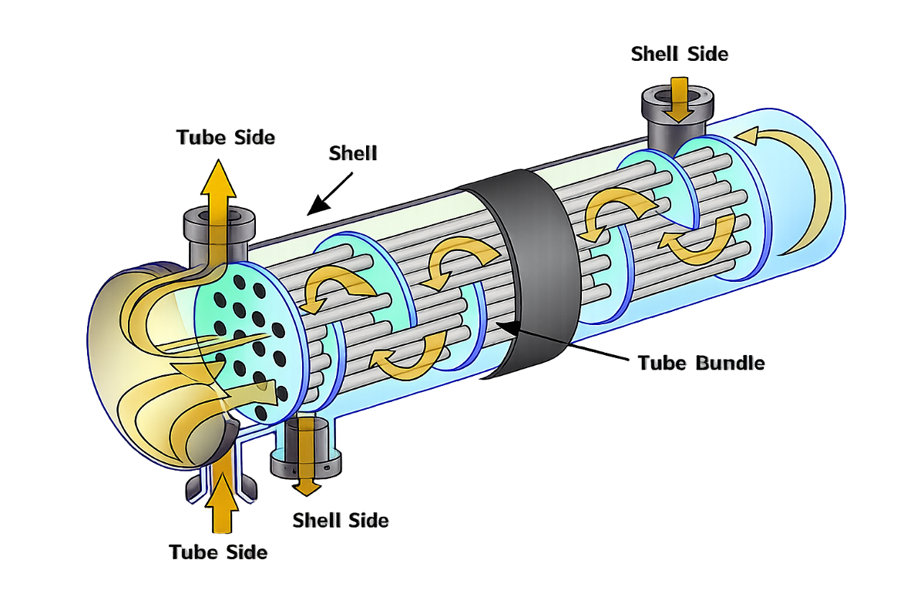

# Projeto de ML para predição de eficiência de troca térmica



## Sobre o projeto

Trocadores de calor do tipo **casco e tubos** (*shell-and-tube*) são equipamentos amplamente usados na indústria química, petroquímica e de energia para transferir calor entre dois fluidos: um escoa pelos **tubos** (*tube side*) e o outro pelo **casco** (*shell side*), ao redor do feixe tubular (*tube bundle*). A **eficiência de troca térmica** depende de variáveis como vazões, temperaturas de entrada/saída, propriedades dos fluidos e geometria do equipamento — e estimá-la com precisão é fundamental para projeto, otimização operacional e detecção de incrustação (*fouling*).

Este repositório implementa um pipeline de Machine Learning ponta-a-ponta para esse problema:

- **Treino**: lê dados históricos de operação (`data/heat_exchanger.db`) e ajusta um modelo de regressão que prediz a eficiência do trocador, salvando o artefato versionado em `artifacts/`.
- **Inferência**: carrega o modelo treinado e responde a consultas sobre eficiência esperada para condições operacionais informadas via CLI.
- **Empacotamento**: cada etapa roda em sua própria imagem Docker (build multi-stage) para garantir reprodutibilidade e isolar dependências.
- **CI/CD**: o workflow do GitHub Actions ([.github/workflows/build.yml](.github/workflows/build.yml)) constrói, valida, publica multi-arquitetura no Docker Hub e executa smoke tests a cada push na branch `modulo07`.

Imagens publicadas:

- [`mitoura/docker-ml-projeto-train`](https://hub.docker.com/r/mitoura/docker-ml-projeto-train) — treina o modelo e gera o artefato `.pkl`.
- [`mitoura/docker-ml-projeto-inference`](https://hub.docker.com/r/mitoura/docker-ml-projeto-inference) — executa inferência usando o artefato gerado.

---

## 1. Ambiente local de desenvolvimento

1. Criar o ambiente virtual (`.venv`):
```bash
python -m venv .venv
```

2. Ativar o ambiente virtual:
- macOS / Linux:
```bash
source .venv/bin/activate
```
- Windows:
```bat
.venv\Scripts\activate.bat
```

3. Instalar as dependências (escolha o conjunto desejado):
```bash
pip install -r requirements-train.txt
pip install -r requirements-inference.txt
```

---

## 2. Build local das imagens

As mesmas imagens publicadas no Docker Hub podem ser construídas localmente a partir dos `Dockerfile`s do repositório.

- Imagem de treino:
```bash
docker build -f Dockerfile.train -t docker-ml-projeto-train .
```

- Imagem de inferência:
```bash
docker build -f Dockerfile.inference -t docker-ml-projeto-inference .
```

Para reproduzir exatamente o build do CI (multi-arquitetura `linux/amd64` + `linux/arm64`) e já marcar com o nome usado no Docker Hub:

```bash
docker buildx build \
  --platform linux/amd64,linux/arm64 \
  -f Dockerfile.train \
  -t mitoura/docker-ml-projeto-train:local \
  .

docker buildx build \
  --platform linux/amd64,linux/arm64 \
  -f Dockerfile.inference \
  -t mitoura/docker-ml-projeto-inference:local \
  .
```

---

## 3. Executar os containers construídos localmente

- Container de treino (persiste o artefato no host via bind mount):
```bash
docker run -v $(pwd)/artifacts:/app/artifacts docker-ml-projeto-train
```

Sintaxe equivalente usando `--mount`:
```bash
docker run --mount type=bind,source=$(pwd)/artifacts,target=/app/artifacts docker-ml-projeto-train
```

Para salvar o modelo dentro de um volume nomeado (`ml-artifacts`):
```bash
docker run -v ml-artifacts:/app/artifacts docker-ml-projeto-train
```

- Container de inferência (informe a versão do modelo gerado no treino):
```bash
docker run -v $(pwd)/artifacts:/app/artifacts docker-ml-projeto-inference \
  python src/inference.py --efficiency 300 --version <str>
```

```bash
docker run -v $(pwd)/artifacts:/app/artifacts docker-ml-projeto-inference \
  python src/inference.py --data 90 --version <str>
```

Usando volume nomeado:
```bash
docker run -v ml-artifacts:/app/artifacts docker-ml-projeto-inference \
  python src/inference.py --efficiency 300 --version heat_efficiency_model_2026-05-03_22-04-04
```

---

## 4. Consumir as imagens publicadas no Docker Hub

As imagens publicadas pelo workflow são versionadas com `MAJOR.MINOR.PATCH`, onde `MAJOR` corresponde ao `run_number` do GitHub Actions (ex.: `4.0.0`). Substitua `<TAG>` pela versão desejada — ou consulte as tags disponíveis em:

- https://hub.docker.com/r/mitoura/docker-ml-projeto-train/tags
- https://hub.docker.com/r/mitoura/docker-ml-projeto-inference/tags

### 4.1. Pull das imagens

```bash
docker pull mitoura/docker-ml-projeto-train:<TAG>
docker pull mitoura/docker-ml-projeto-inference:<TAG>
```

### 4.2. Treino (gera o artefato em `./artifacts`)

```bash
docker run -v $(pwd)/artifacts:/app/artifacts \
  mitoura/docker-ml-projeto-train:<TAG>
```

Ou usando volume nomeado para reaproveitar o artefato entre execuções:
```bash
docker run -v ml-artifacts:/app/artifacts \
  mitoura/docker-ml-projeto-train:<TAG>
```

### 4.3. Inferência

Reaproveitando o artefato gerado no passo anterior:
```bash
docker run -v $(pwd)/artifacts:/app/artifacts \
  mitoura/docker-ml-projeto-inference:<TAG> \
  python src/inference.py --efficiency 300 --version <MODEL_VERSION>
```

Com volume nomeado:
```bash
docker run -v ml-artifacts:/app/artifacts \
  mitoura/docker-ml-projeto-inference:<TAG> \
  python src/inference.py --efficiency 300 --version <MODEL_VERSION>
```

> `<MODEL_VERSION>` é o nome do arquivo gerado pelo container de treino dentro de `artifacts/` (ex.: `heat_efficiency_model_2026-05-03_22-04-04`).

---

## 5. Pipeline de CI/CD

O workflow [.github/workflows/build.yml](.github/workflows/build.yml) é disparado por `push` na branch `modulo07` e executa, em sequência:

1. **build** — build local (`load: true`) das duas imagens com cache via GHA.
2. **validacao** — rebuild e execução das imagens para validar o ciclo treino → inferência.
3. **publish** — login no Docker Hub e push multi-arch (`linux/amd64`, `linux/arm64`) com a tag `${{ github.run_number }}.0.0`.
4. **smoke-test** — `docker pull` da tag recém publicada e execução de treino + inferência para confirmar que a imagem está utilizável.

Secrets necessários no repositório:

- `DOCKERHUB_USERNAME`
- `DOCKERHUB_PASSWORD`

---

## Comandos úteis de Docker

- `docker ps` — containers em execução.
- `docker ps -a` — todos os containers (inclusive finalizados).
- `docker run hello-world` — imagem de teste do Docker Hub.
- `docker run -it ubuntu bash` — abre um shell em um container Ubuntu (`-it` = interativo + tty).
- `docker stop <CONTAINER_ID>` — para um container.
- `docker start <CONTAINER_ID>` — reinicia um container parado.
- `docker exec -it <CONTAINER_ID> bash` — executa um shell em um container já em execução.
